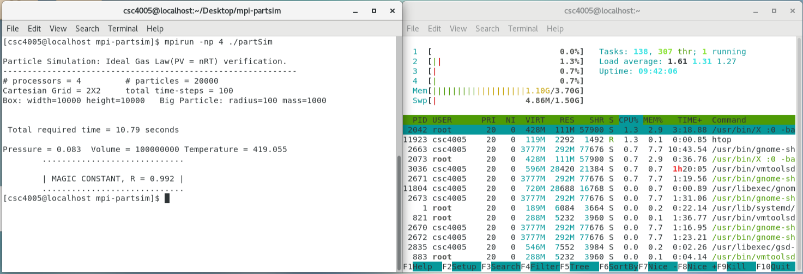

# mpi-part-simulation

MPI-backed parallel particle simulation (idal gas law, pV = nRT, verification).

This is an MPI-backed parallel implementation of particle simulation and the verification of ideal gas law `PV = nRT` by simulating the particles movement and interaction. It also shows something called *Brownian* motion. Here, we assume that particles are hard with radius 1 and all collisions are elastic. The box is a 2-dimensional rectangle without any friction. In order to show the *Brownian* motion a particle with greater mass and radius has been inserted into the box. The trajectory of this big particle has been monitored. For more details about the problem, the reader is reffered to the `Particle Simulation (Problem Description).pdf` which is available in the `docs` directory.

The goal of this project is to parallelize the simulation process uding MPI. In this project, typical physics simulation approaches have been followed. If we have `P` number of processors then entire box is divided into `P` small regions and each processor is responsible for one region. If we have total `N` particles then every processor will distribute uniformly `N/P` particles into its region. For more details about the distribution of particles, the reader is reffered to the `Particle Simulation (Tehcnical Report).pdf` which is available in the `docs` directory.

The goal of the parallelization is to make the code highly efficient for a parallel system (i.e., distributed memory environment) and to make it as scalable as possible to do large-scale simulations. 

Usage
-----
To build and run the program type 
```
make
rm -rf *.o
```

inside this directory.

To run:

```
mpirun -np 4 ./partSim
```

To monitor cpu usage:

```
htop
```

Screenshot
-----
Run


Result



To change the dimension of box, go to `definitions.h` and update the macro definitions *BOX_HORIZ_SIZE* & *BOX_VERT_SIZE*.
	
		BOX_HORIZ_SIZE = 10000.0
		BOX_VERT_SIZE  = 10000.0

To change the *number of particles* go to `mpiPartSim.c` and update the variable *gNumParts*.		

		gNumParts = 12000

To change the total *time-step*s go to `mpiPartSim.c` and update macro definition *TOTAL_TIME*.
		
		TOTAL_TIME = 100

To change the the dimension of big particle go to `mpiPartSim.c` and update the variables *bigPartRadius* & *bigPartMass*

		bigPartRadius  = 100.0
		bigPartMass    = 1000.0

Complexity
----------
If we assume that *time-step* is a constant, the asymptotic complexity of sequential program is `O(N^2)`, where `N` is the
number of particles. Here, each particle needs to be checked against every other particle for collision. In parallel implementation, if the distribution of particles is assumed uniform the asymptotic complexity is `O(N^2)/P`, where `P` is the number of processor.

Reference
---------
For more details (e.g., implementation, performance, etc.), the reader is reffered to the technical report available in `docs` directory.

Acknowledgement
---------------
Computational resources are provided by ACENET, the regional advanced research computing consortium for universities in Atlantic Canada. ACENET is funded by the Canada Foundation for Innovation (CFI), the Atlantic Canada Opportunities Agency (ACOA), and the provinces of Newfoundland & Labrador, Nova Scotia, and New Brunswick.

This project is also tested in CSSun cluster which is hosted in *cssuncluster.stfx.ca*.

Copyright
-----

Submitted by Md Mokarrom Hossain 

Student ID # 201304460 

X2013idf@stfx.ca

Winter 2014